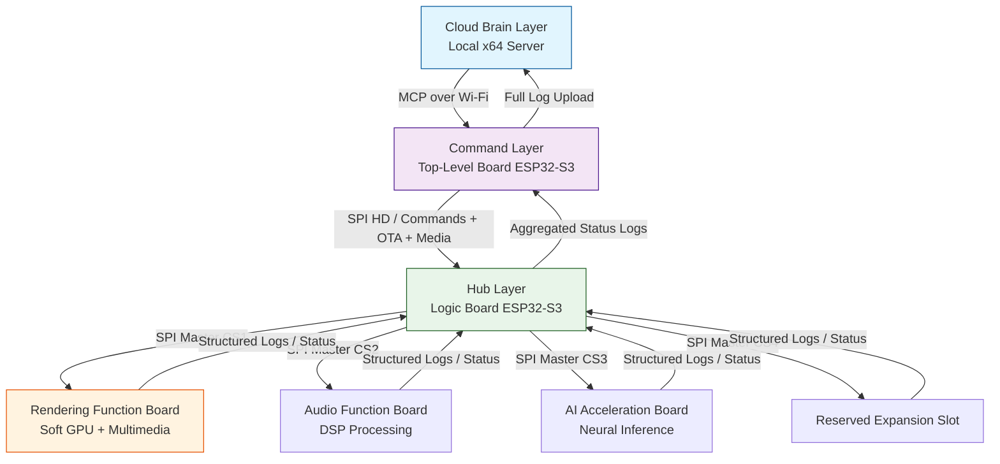

# Nexus-4D

**ESP32-S3 based 4-Dimensional Distributed Heterogeneous Compute Cluster** · Vector-Dictionary Transmission · Soft-GPU Pipeline · Self-Evolving OTA

> **Four-Layer Edge Architecture:** Cloud (x86 Strategy) → Command (Wi-Fi Scheduler) → Hub (DMA Bypass) → Execution (Rendering/Audio)  
> **Core Status:** ✅ Validated | **Render Subsystem:** 🚧 In Dev

---

## About This Project
This project proposes a distributed heterogeneous edge computing architecture built on the ESP32-S3 platform. It splits four core roles — computing, scheduling, rendering, and peripheral management — into independent chips interconnected via a high-speed SPI bus, completely eliminating the resource contention bottleneck of single-chip solutions.

The v2.0 release introduces a dedicated rendering function board with a general-purpose software-defined GPU (Soft GPU) pipeline. Implemented with triangle primitives and MVP digital matrix transformation, this pipeline replaces traditional MCU 2D graphics libraries and provides a unified computing foundation for 2D UI, multimedia playback, and future 3D rendering expansion. The entire stack is engineered on top of the mature Retro-Go driver framework for maximum reliability and minimum adaptation cost.

## Core Advantages
- **Complete Resource Decoupling**  
  Four physically isolated layers run independently without competing for CPU or memory. Single-module failures do not affect the whole system, delivering higher stability and linearly scalable performance.

- **General-Purpose Soft GPU Pipeline**  
  A single rendering engine covers 2D UI, image transformation, audio spectrum visualization, and video frame output. Built around a fixed-function pipeline paradigm, it natively supports smooth expansion to 3D rendering.

- **Modular Heterogeneous Expansion**  
  All function boards use a standardized identity descriptor protocol for automatic hot-plug discovery and binding. Rendering, audio, AI acceleration, and sensor aggregation nodes can be mounted on demand with active-standby failover.

- **High-Reliability OTA System**  
  Local SD card firmware repository combined with A/B partition atomic rollback supports both online upgrades and offline reflashing. Failed upgrades automatically revert to a safe version without downtime.

- **Retro-Go Ecosystem Reuse**  
  Built on proven Retro-Go subsystems including display drivers, I2S audio, dual-core scheduling, and PSRAM memory management, significantly reducing development and hardware adaptation risk.

## Architecture Overview
The system follows a strictly decoupled four-layer design, forming a complete decision → scheduling → execution chain from top to bottom. No cross-layer direct communication is allowed.

| Layer | Board | Core Responsibilities | Permission Level |
|-------|-------|-----------------------|------------------|
| Cloud Brain Layer | Local x64 desktop server | Deep learning training, policy generation, firmware & media resource compilation | Highest; only node permitted to modify top-level board policies |
| Command Layer | Top-Level Board (ESP32-S3 + Wi-Fi) | Policy AI execution, log aggregation, upgrade scheduling, resource distribution | Cluster decision hub |
| Hub Layer | Logic Board (ESP32-S3 + SD Card) | Bus enumeration, device routing, peripheral management, firmware repository, offline reflashing | Sole bus master; routes traffic without parsing business logic |
| Execution Layer | Multiple Function Boards (ESP32-S3) | Atomic task execution: rendering, audio decoding, neural inference, etc. | Responds only to bus commands; no direct inter-board communication |

> For full interaction topology, protocol frame format, and detailed sequence diagrams, see [ARCHITECTURE.md](./ARCHITECTURE.md).

## Core Interaction Workflows
### 1. Power-On Auto Discovery
On boot, the Logic Board broadcasts discovery queries through each CS pin. Each function board replies with a 64-byte standardized identity descriptor. The Logic Board then registers the device into its routing table, loads the matching driver, and reports the device list upstream — all fully automatic without manual configuration.

### 2. End-to-End Multimedia Rendering
The Top-Level Board issues playback commands. The Logic Board streams fragmented media data from the SD card to the rendering and audio function boards via SPI. The Soft GPU pipeline handles decoding, matrix transformation, rasterization, and DMA frame output in parallel, with structured status logs returned periodically.

### 3. OTA Update with Atomic Rollback
Firmware images are distributed to the local SD card repository. During low-load periods, the Logic Board forwards firmware fragments to the target board, which writes to its backup OTA partition. If heartbeat communication fails within 10 seconds after reboot, a hardware watchdog triggers an automatic rollback to the stable main partition.

## Current Validation Status
| Status | Modules |
|--------|---------|
| ✅ Validated | Dual-board SPI HD communication (Logic Board + single Function Board) Basic device discovery and routing table maintenance SD card FATFS file system driver Core architecture stability testing |
| 🔧 In Development | Rendering function board base framework (Retro-Go port) Soft GPU pipeline (matrix transform + triangle rasterization) Multimedia decoder integration (JPEG / MP3 / MJPEG) Rendering-board-specific SPI instruction set |
| 📋 Designed, Pending Implementation | Dynamic scheduling priority adjustment on Logic Board Top-Level Board Wi-Fi MCP communication protocol Full OTA dual-file distribution + atomic rollback chain Distributed AI logging closed loop |

## Documentation
- 📄 **[Full Technical Paper v2.0](./ESP32_cluster_paper.md)** — Complete architecture design, protocol stack, Soft GPU implementation details, storage system, and OTA mechanism
- 🏗️ **[Architecture Deep Dive](./ARCHITECTURE.md)** — Full interaction topology, sequence diagrams, and communication protocol specifications
- 🛠️ Getting Started Guide — Hardware setup, compilation, and flashing instructions (coming soon)

## License
This project is released under the **MIT License**. You are free to use, modify, and distribute the design with proper attribution.
